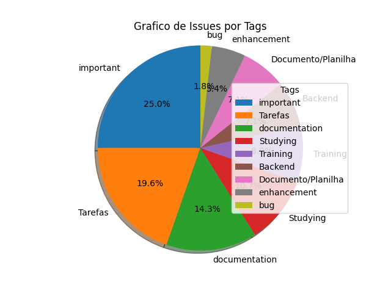
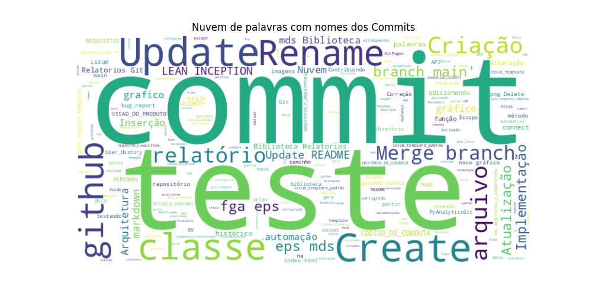

## PyAnalyticsGit - Relatório automatizado

# Issues
- Título: Criação de método para contagem de Issues
- Estado: open
- Número: 29
- Labels: Tarefas, important, Backend
---------------------
- Título: Adicionar try-except na classe Connect
- Estado: closed
- Número: 28
- Labels: important, Backend
---------------------
- Título: Atualizar Github-pages
- Estado: open
- Número: 27
- Labels: enhancement
---------------------
- Título: Criação das classes dos gráficos e tabelas
- Estado: open
- Número: 26
- Labels: important, Backend
---------------------
- Título: Erros na Classe Issue
- Estado: open
- Número: 25
- Labels: bug, Tarefas, important
---------------------
- Título: Criação dos métodos para automatizar a biblioteca
- Estado: open
- Número: 24
- Labels: important, Backend
---------------------
- Título: Estudo subprocess e automatização 
- Estado: open
- Número: 23
- Labels: 
---------------------
- Título: Criação do UML da Biblioteca
- Estado: open
- Número: 22
- Labels: documentation, Tarefas
---------------------
- Título: Estudo da API do github
- Estado: open
- Número: 21
- Labels: important, Studying, Training
---------------------
- Título: Visão de Produto
- Estado: open
- Número: 20
- Labels: documentation, enhancement, important
---------------------
- Título: Definição da Identidade Visual do Projeto
- Estado: closed
- Número: 19
- Labels: documentation
---------------------
- Título: Definição da Arquitetura
- Estado: closed
- Número: 18
- Labels: documentation, Tarefas, important
---------------------
- Título: Preparo para apresentação R1
- Estado: closed
- Número: 17
- Labels: Tarefas
---------------------
- Título: Criação do Template padrão de Issue
- Estado: closed
- Número: 16
- Labels: documentation
---------------------
- Título: Git Pages 
- Estado: closed
- Número: 15
- Labels: documentation, Tarefas, important, Studying
---------------------
- Título: Implementação básica para a R1
- Estado: closed
- Número: 14
- Labels: enhancement, Tarefas, important
---------------------
- Título: Levantamento de Requisitos
- Estado: closed
- Número: 13
- Labels: Tarefas, important
---------------------
- Título: Definição do Escopo do projeto
- Estado: closed
- Número: 12
- Labels: documentation, Tarefas, important
---------------------
- Título: Criação do Pull_Request Template
- Estado: closed
- Número: 11
- Labels: documentation
---------------------
- Título: Adição do Código de conduta
- Estado: closed
- Número: 10
- Labels: Documento/Planilha, important
---------------------
- Título: Estudo/Treinamento Git e GitHub
- Estado: closed
- Número: 9
- Labels: Studying, Training
---------------------
- Título: Estudo/Treinamento Levantamento de Requisitos
- Estado: closed
- Número: 8
- Labels: Studying, Training
---------------------
- Título: Estudo/Treinamento - Python 
- Estado: closed
- Número: 7
- Labels: Studying, Training
---------------------
- Título: Estudo/Treinamento de Scrum
- Estado: closed
- Número: 6
- Labels: important, Studying, Training
---------------------
- Título: Planilha de Conhecimentos
- Estado: closed
- Número: 5
- Labels: Documento/Planilha
---------------------
- Título: Documento de organização de horários 
- Estado: closed
- Número: 4
- Labels: Documento/Planilha
---------------------
- Título: Planilha para organização de horários e ponto de controle
- Estado: closed
- Número: 3
- Labels: Documento/Planilha
---------------------
- Título: Definição de horário para as reuniões
- Estado: closed
- Número: 2
- Labels: Tarefas
---------------------
- Título: Proposta de temas 
- Estado: closed
- Número: 1
- Labels: Tarefas
---------------------

# Milestones
- Título: Sprint 7
- Cirado em: 17/05/2023
- Descrição: Nessa Sprint o escopo e visão do produto passará por ajustes e o UML do projeto será estruturado com todos os módulos de funcionamento da biblioteca. Também sera feito ajustes no Backlog do projeto e será iniciado uma implementação inicial utilizando a API do GitHub. 
- Issues Abertas: 1
- Issues Fechadas: 0
---------------------
- Título: Sprint 08 
- Cirado em: 30/05/2023
- Descrição: 
- Issues Abertas: 2
- Issues Fechadas: 0
---------------------
- Título: Sprint 09
- Cirado em: 30/05/2023
- Descrição: 
- Issues Abertas: 1
- Issues Fechadas: 0
---------------------

# Commits
- hash do commit: d101c300c03b6914e5cf4628087133e75de4aee2
- author do commit: Tiago1604
- Mensagem: Merge branch 'main' of https://github.com/fga-eps-mds/2023.1-Biblioteca-Relatorios-Git
----------------------------
- hash do commit: 6d2e8ad121174c035a1b0105771b12caf6cfa78d
- author do commit: Tiago1604
- Mensagem: Correção de erro no except
----------------------------
- hash do commit: f684b0d02f943163a1d4f7ba0114e0aba92553b6
- author do commit: Tiago1604
- Mensagem: Create python-app.yml
----------------------------
- hash do commit: 38f16ce265580b5b82dbbe49ead208ee7258b4b7
- author do commit: Tiago1604
- Mensagem: Merge branch 'main' of https://github.com/fga-eps-mds/2023.1-Biblioteca-Relatorios-Git
----------------------------
- hash do commit: 718019fb6740f865ebb6be9f4465b4605bf6da14
- author do commit: PedroHhenriq
- Mensagem: Criação do gráfico de pizza e atualização da nuvem de palavras
----------------------------
- hash do commit: d1f28a6b2267fa1558c3e46d956f791901c5b649
- author do commit: Tiago1604
- Mensagem: Teste 2
----------------------------
- hash do commit: 9d251c5106ddf3673963163432d5b163b6840cf9
- author do commit: Tiago1604
- Mensagem: teste de automação
----------------------------
- hash do commit: 80bd6e1e2ea13f5b58d4d31e825e9dbfcf372b7e
- author do commit: JeffersonSenaa
- Mensagem: Merge branch 'main' of github.com:fga-eps-mds/2023.1-PyAnalyticsGit
----------------------------
- hash do commit: 912fd579b94f7f4fa3e8b2eca3768df3099c70d0
- author do commit: JeffersonSenaa
- Mensagem: Inclusão de Graficos e Nuvem de palavras
----------------------------
- hash do commit: 83f466eba8d6ee7620783cd0519fbe2124b0209d
- author do commit: JeffersonSenaa
- Mensagem: Teste 3 de commit gerando evento para criar relatório
----------------------------
- hash do commit: d1c5e3808e2e740381c7b4dc071dbae5fba6bed8
- author do commit: JeffersonSenaa
- Mensagem: Teste 2 de commit gerando evento para criar relatório
----------------------------
- hash do commit: 5e0bb64a9420f6407a3215dae9933469426e2dcb
- author do commit: JeffersonSenaa
- Mensagem: Teste de commit gerando evento para criar relatório
----------------------------
- hash do commit: 4d70011081cf10db6d2ef7a6364500f5545d0208
- author do commit: Mateus Levy
- Mensagem: corrigindo bugs e classe issue
----------------------------
- hash do commit: f35d5bf98b4dade02907378d0a2412f0c3465e16
- author do commit: Mateus Levy
- Mensagem: adicionando try except na classe connect e corrigindo bugs
----------------------------

