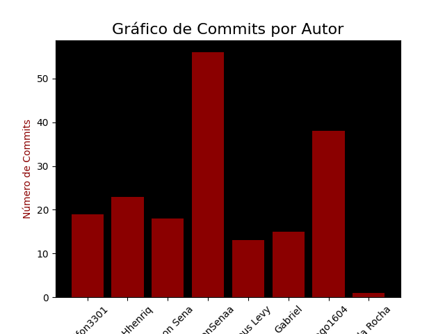
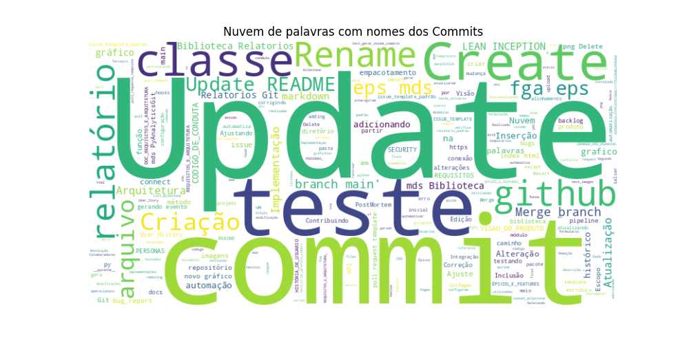
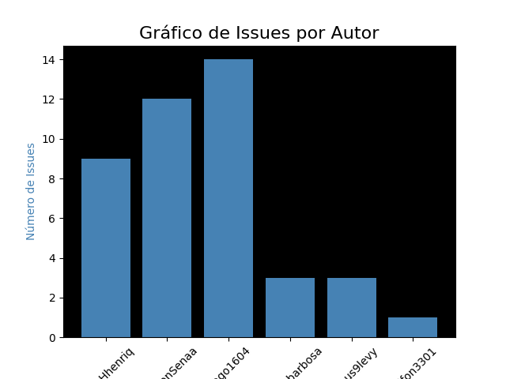
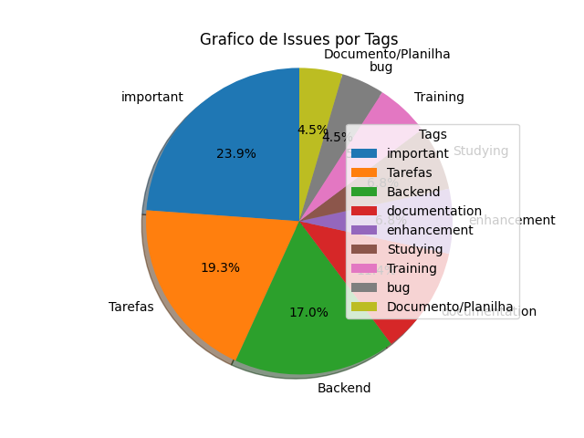
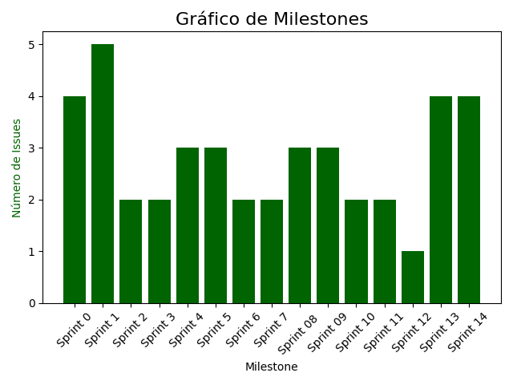

# Relatório dos dados do Repositório
# Commits

## Grafico de Commits

# Tabela - Quantidade de Commits por Membro

| Membro | Quantidade de Commits |
| --- | ---: |
| rodfon3301 | 22 |
| PedroHhenriq | 27 |
| Tiago1604 | 40 |
| Jefferson Sena | 18 |
| JeffersonSenaa | 56 |
| Mateus Levy | 13 |
| Gabriel | 15 |
| Carla Rocha | 1 |

# Tabela de Commits por Autor

## rodfon3301

| Commit | Data |
| --- | --- |
| Update Arquitetura.md | 2023-07-12 |
| Update README.md | 2023-07-12 |
| Update README.md | 2023-07-12 |
| Update README.md | 2023-07-12 |
| Update README.md | 2023-07-12 |
| Update README.md | 2023-05-09 |
| Update README.md | 2023-05-09 |
| Rename REQUISITOS_E_ARQUITETURA.md to REQUISITOS_E_ARQUITETURA_(LEAN INCEPTION).md | 2023-05-09 |
| Rename PERSONAS.md to PERSONAS_(LEAN INCEPTION).md | 2023-05-09 |
| Rename ÉPICOS_E_FEATURES.md to ÉPICOS_E_FEATURES_(LEAN INCEPTION).md | 2023-05-09 |
| Create ÉPICOS_E_FEATURES.md | 2023-05-09 |
| Create PERSONAS.md | 2023-05-09 |
| Rename DOC_REQUISITOS_E_ARQUITETURA.md to REQUISITOS_E_ARQUITETURA.md | 2023-05-09 |
| Create DOC_REQUISITOS_E_ARQUITETURA.md | 2023-05-09 |
| Update README.md | 2023-05-09 |
| Update README.md | 2023-05-09 |
| Update Arquitetura.md | 2023-05-09 |
| Update Arquitetura.md | 2023-05-08 |
| Update and rename ARQUITETURA.md to Arquitetura.md | 2023-05-08 |
| Update and rename Arquitetura.md to ARQUITETURA.md | 2023-05-06 |
| Create Arquitetura.md | 2023-05-06 |
| Update README.md | 2023-05-05 |

## PedroHhenriq

| Commit | Data |
| --- | --- |
| Ajustes no Backlog | 2023-07-12 |
| Update PostMortem.md | 2023-07-12 |
| Ajustes e Atualização da Arquitetura | 2023-07-12 |
| Ajustando e atualizando o Escopo | 2023-07-12 |
| Ajustando o documento da Visão do Produto | 2023-07-12 |
| Criação do gráfico de pizza e atualização... | 2023-06-19 |
| Incremento nas classes Gráfico e Nuvem de... | 2023-06-14 |
| Alteração da classe relatório, nuvem e grafico... | 2023-06-01 |
| Alteração da classe relatorio, mudança de pasta... | 2023-06-01 |
| Criação da classe Gráfico e da classe... | 2023-05-31 |
| Delete Criação do arquivo imagens | 2023-05-09 |
| Add files via upload | 2023-05-09 |
| Create Arquivo imagens | 2023-05-09 |
| Delete Personas.png | 2023-05-09 |
| Delete Jornadas dos Usuários.png | 2023-05-09 |
| Delete Requisitos e Arquitetura.png | 2023-05-09 |
| Delete User_Story.png | 2023-05-09 |
| Delete Épicos.png | 2023-05-09 |
| imagens | 2023-05-09 |
| Update VISAO_DO_PRODUTO.md | 2023-05-08 |
| Create REQUISITOS.MD | 2023-05-06 |
| Update VISAO_DO_PRODUTO.md | 2023-05-06 |
| Update VISAO_DO_PRODUTO.md | 2023-05-01 |
| Rename Visão do produto.md to VISAO_DO_PRODUTO.md | 2023-04-28 |
| Create Visão do produto.md | 2023-04-28 |
| Rename Contribuindo.md to CONTRIBUINDO.md | 2023-04-27 |
| Create Contribuindo.md | 2023-04-27 |

## Tiago1604

| Commit | Data |
| --- | --- |
| Update PostMortem.md | 2023-07-12 |
| Update PostMortem.md | 2023-07-12 |
| Merge branch 'main' of https://github.com/fga-eps-mds/2023.1-Biblioteca-Relatorios-Git | 2023-07-10 |
| Inclusão na main da alteração do relatório... | 2023-07-10 |
| Merge branch 'main' of https://github.com/fga-eps-mds/2023.1-Biblioteca-Relatorios-Git | 2023-06-20 |
| Correção de erro no except | 2023-06-20 |
| Create python-app.yml | 2023-06-20 |
| Merge branch 'main' of https://github.com/fga-eps-mds/2023.1-Biblioteca-Relatorios-Git | 2023-06-20 |
| Teste 2 | 2023-06-19 |
| teste de automação | 2023-06-19 |
| Correção de bugs | 2023-06-15 |
| Criação do metodo de issue na Main | 2023-06-14 |
| Conexão da classe commit e connect | 2023-06-06 |
| Criação do .env | 2023-06-06 |
| Integração das classes issue e relatorio | 2023-06-02 |
| Teste de automatização para evento de commit | 2023-06-01 |
| commit de mudanças de testes | 2023-06-01 |
| Correção de erro no markdown gerado. | 2023-05-30 |
| Atualização da Classe issue para abrir relatório. | 2023-05-30 |
| Implementação da classe repositório | 2023-05-29 |
| Alteração do GitPages | 2023-05-09 |
| Atualização da função commit | 2023-05-08 |
| Ajustando a formatação do Markdown | 2023-05-07 |
| testando markdown | 2023-05-07 |
| testando | 2023-05-07 |
| alinhamento do markdown(teste) | 2023-05-07 |
| teste alinhamento | 2023-05-07 |
| Criação do formulario em markdown | 2023-05-07 |
| Update main.py | 2023-05-06 |
| tenstando conexão com vscode | 2023-05-06 |
| Inicio da implementação da biblioteca e gitPython. | 2023-05-04 |
| Rename Index.html to index.html | 2023-05-03 |
| Update README.md | 2023-05-02 |
| testando temas do GitPages | 2023-05-02 |
| Update CODIGO_DE_CONDUTA.md | 2023-04-27 |
| Update CODIGO_DE_CONDUTA.md | 2023-04-26 |
| Update CODIGO_DE_CONDUTA.md | 2023-04-26 |
| Update CODIGO_DE_CONDUTA.md | 2023-04-26 |
| Rename CODIGO_DE_CONDUTA to CODIGO_DE_CONDUTA.md | 2023-04-26 |
| Criação do código de conduta | 2023-04-26 |

## Jefferson Sena

| Commit | Data |
| --- | --- |
| Merge pull request #39 from fga-eps-mds/teste_unitario/pipeline Implementação... | 2023-07-12 |
| Update index.html | 2023-05-09 |
| Rename issue_template_padrão.md to issue_template_padrao.md | 2023-05-09 |
| Create pull_request.md | 2023-05-09 |
| Create issue_template_padrão.md | 2023-05-09 |
| Create bug_report.md | 2023-05-09 |
| Adicionando função para salvar grafico no relatorio... | 2023-05-08 |
| Update README.md | 2023-05-07 |
| Update README.md | 2023-05-07 |
| Update main.py | 2023-05-04 |
| Edição do caminho do arquivo pull_requeste_template.md | 2023-05-02 |
| Rename docs/pull_request_template.md to docs/.github/ISSUE_TEMPLATE/pull_request_template.md | 2023-05-02 |
| Rename docs/bug_report.md to .github/ISSUE_TEMPLATE/bug_report.md | 2023-04-30 |
| Create issue_template_padrao.md | 2023-04-30 |
| Criação do bug_report.md | 2023-04-26 |
| Atualização README.md | 2023-04-26 |
| Create pull_request_template.md | 2023-04-26 |
| Edição do Arquivo Readme. Edição dos tópicos... | 2023-04-24 |

## JeffersonSenaa

| Commit | Data |
| --- | --- |
| Ajustes no pipeline. | 2023-07-11 |
| Ajustes nas classes de testes dis sistemas... | 2023-07-11 |
| Resolução de conflitos. | 2023-07-11 |
| Alterações nos pacotes da biblioteca e configuração... | 2023-07-11 |
| Realizado empacotamento e upload para o PyPi. | 2023-07-11 |
| Modificações para estruturação do empacotamento. | 2023-07-10 |
| Merge branch 'main' of github.com:fga-eps-mds/2023.1-PyAnalyticsGit | 2023-06-20 |
| Implementação dos elementos gráficos no relatório em... | 2023-06-20 |
| Merge branch 'main' of github.com:fga-eps-mds/2023.1-PyAnalyticsGit | 2023-06-15 |
| Inclusão de Graficos e Nuvem de palavras | 2023-06-15 |
| Teste 3 de commit gerando evento para... | 2023-06-15 |
| Teste 2 de commit gerando evento para... | 2023-06-15 |
| Teste de commit gerando evento para criar... | 2023-06-15 |
| Merge branch 'main' of github.com:fga-eps-mds/2023.1-PyAnalyticsGit | 2023-06-15 |
| Ajuste do Path dos arquivos que configuram... | 2023-06-15 |
| Merge branch 'main' of github.com:fga-eps-mds/2023.1-PyAnalyticsGit | 2023-06-15 |
| Remoção de arquivos temporários e automação dos... | 2023-06-15 |
| Terceiro teste de automação do biblioteca. A... | 2023-06-15 |
| Segundo teste de automação da biblioteca | 2023-06-14 |
| Teste de automação da biblioteca | 2023-06-14 |
| Implementação do fluxo de automação da biblioteca... | 2023-06-14 |
| Merge da branch testes para main. Foi... | 2023-06-13 |
| Implementação de método que busca o caminho... | 2023-06-13 |
| Implementação do método que verifica o arquivo... | 2023-06-13 |
| Alteração no arquivo hooks e testes de... | 2023-06-01 |
| Teste de automatização | 2023-06-01 |
| Teste de integração | 2023-06-01 |
| Criação da classe relatório que será a... | 2023-05-31 |
| Criação da função que gera o caminho... | 2023-05-30 |
| Implementação da função que autmoatiza commits | 2023-05-29 |
| Teste | 2023-05-29 |
| Criação da função que automatiza o relatório... | 2023-05-29 |
| Implementaçao do pacote estrutura e classe para... | 2023-05-27 |
| Atualização no relatório | 2023-05-09 |
| Inserção de novo gráfico do histórico de... | 2023-05-09 |
| Merge branch 'main' of github.com:fga-eps-mds/2023.1-Biblioteca-Relatorios-Git | 2023-05-09 |
| Revert "Rename User_History (LEAN INCEPTION).md to HISTÓRIA_DE_USUARIO... | 2023-05-09 |
| Inserção de novo gráfico do histórico de... | 2023-05-09 |
| Merge branch 'main' of github.com:fga-eps-mds/2023.1-Biblioteca-Relatorios-Git | 2023-05-09 |
| Inserção de novo gráfico do histórico de... | 2023-05-09 |
| Inserção de novo gráfico do histórico de... | 2023-05-09 |
| Atualização do título do head | 2023-05-09 |
| Merge branch 'main' of github.com:fga-eps-mds/2023.1-Biblioteca-Relatorios-Git | 2023-05-09 |
| Atualização do diretório | 2023-05-09 |
| Atualização do diretório | 2023-05-09 |
| Atualização do diretório do codigo fonte | 2023-05-09 |
| Implementação inicial das funcionalidades da biblioteca com... | 2023-05-08 |
| Deletando arquivo de teste da implementação | 2023-05-08 |
| Inserção do grafico no arquivo markdown. | 2023-05-08 |
| Implementação inicial do relatório com histórico dos... | 2023-05-08 |
| Adicionando comando para salvar grafico no arquivo... | 2023-05-08 |
| Inserção de gráfico do número de commits... | 2023-05-07 |
| Merge branch 'main' of github.com:fga-eps-mds/2023.1-Biblioteca-Relatorios-Git | 2023-05-06 |
| Merge branch 'main' of github.com:fga-eps-mds/2023.1-Biblioteca-Relatorios-Git | 2023-05-04 |
| Alteração no arquivo index.html | 2023-05-04 |
| Criação do Git Pages do projeto em... | 2023-05-03 |

## Mateus Levy

| Commit | Data |
| --- | --- |
| removing marplotlib import from test_images | 2023-07-11 |
| adding test_criar_grafico_commit() | 2023-07-11 |
| adding test_gerar_nuvem_commits() | 2023-07-11 |
| corrigindo bugs e classe issue | 2023-06-15 |
| adicionando try except na classe connect e... | 2023-06-15 |
| connet_milestone() in connect | 2023-06-07 |
| criação da classe connect | 2023-06-06 |
| Update issue templates | 2023-06-06 |
| Mudancas no relatorio_padrao.md | 2023-06-06 |
| adicionando __pycache__/ .gitignore | 2023-06-06 |
| list_milestone em milestone.py | 2023-05-31 |
| adicionando Api git | 2023-05-18 |
| Update README.md | 2023-05-09 |

## Gabriel

| Commit | Data |
| --- | --- |
| adicionando histórico de versão e atualizando backlog | 2023-07-10 |
| estrutura do relatório técnico | 2023-07-10 |
| post mortem v1 | 2023-07-09 |
| ferramentas utilizadas | 2023-07-08 |
| Adicionando o backlog | 2023-07-08 |
| Rename User_History (LEAN INCEPTION).md to HISTÓRIA_DE_USUARIO (LEAN... | 2023-05-09 |
| Create JORNADA_DOS_USUARIOS(LEAN INCEPTION).md.md | 2023-05-09 |
| Create User_History (LEAN INCEPTION).md | 2023-05-09 |
| Rename Escopo.md to ESCOPO.md | 2023-05-09 |
| Update REQUISITOS.MD | 2023-05-08 |
| Create Escopo.md | 2023-05-08 |
| Update REQUISITOS.MD | 2023-05-06 |
| Update SECURITY.md | 2023-05-02 |
| Update SECURITY.md | 2023-05-02 |
| Create SECURITY.md | 2023-05-02 |

## Carla Rocha

| Commit | Data |
| --- | --- |
| Initial commit | 2023-03-30 |

## Nuvem de Palavras dos Commits

# Issues

## Gráfico de Issues

# Tabela de Quantidade de Issues por Autor

| Autor | Quantidade de Issues |
| --- | ---: |
| Tiago1604 | 15 |
| JeffersonSenaa | 15 |
| gabrie1barbosa | 4 |
| PedroHhenriq | 9 |
| mateus9levy | 3 |
| rodfon3301 | 1 |

# Tabela de Issues por Autor com Tags

## Tiago1604

| Título | Número | Estado | Tags |
| --- | --- | --- | --- |
| Tratar status code 403 | 47 | open | bug, important, Backend |
| Correção de erros da biblioteca no PyPI | 38 | closed | bug, important, Backend |
| Corrigir erros nas variáveis de ambiente | 37 | closed | bug, important, Backend |
| Criação do relatório em pasta docs | 36 | closed | enhancement, important, Backend |
| Relatório gerado a partir do método(sem automação) | 35 | closed | enhancement, important, Backend |
| Criação de método para contagem de Issues | 29 | closed | Tarefas, important, Backend |
| Erros na Classe Issue | 25 | closed | bug, Tarefas, important |
| Estudo da API do github | 21 | closed | important, Studying, Training |
| Visão de Produto | 20 | closed | documentation, enhancement, important |
| Git Pages  | 15 | closed | documentation, Tarefas, important, Studying |
| Implementação básica para a R1 | 14 | closed | enhancement, Tarefas, important |
| Levantamento de Requisitos | 13 | closed | Tarefas, important |
| Definição do Escopo do projeto | 12 | closed | documentation, Tarefas, important |
| Adição do Código de conduta | 10 | closed | Documento/Planilha, important |
| Estudo/Treinamento de Scrum | 6 | closed | important, Studying, Training |

## JeffersonSenaa

| Título | Número | Estado | Tags |
| --- | --- | --- | --- |
| DocStrings | 46 | closed |  |
| Documentação da biblioteca | 44 | closed | documentation, Documento/Planilha, important |
| Lançamento da biblioteca pyanalyticsgit versão 0.0.1 no PyPI | 43 | closed | Tarefas, important, Backend |
| Alterações nos módulos da biblioteca | 40 | closed | bug, Backend |
| Implementação do empacotamento e Pipeline | 39 | closed | Tarefas, Backend |
| Empacotamento e distribuição da biblioteca no testPyPI | 34 | closed | Backend |
| Criar Testes unitáros | 32 | open | Tarefas, important, Backend |
| Implementação do Modulo para Suporte a Diversos Sistemas Operacionais na Biblioteca | 31 | closed | Tarefas, important, Backend |
| Criação do Pipline de Integração Contínua | 30 | closed | Tarefas, Backend |
| Criação dos métodos para automatizar a biblioteca | 24 | closed | important, Backend |
| Criação do UML da Biblioteca | 22 | closed | documentation, Tarefas |
| Definição da Identidade Visual do Projeto | 19 | closed | documentation |
| Criação do Template padrão de Issue | 16 | closed | documentation |
| Criação do Pull_Request Template | 11 | closed | documentation |
| Estudo/Treinamento Git e GitHub | 9 | closed | Studying, Training |

## gabrie1barbosa

| Título | Número | Estado | Tags |
| --- | --- | --- | --- |
| Criação do documento de release e documento guia | 45 | open | documentation, Tarefas |
| Criação de documentos restantes | 33 | open | documentation, Tarefas |
| Estudo subprocess e automatização  | 23 | closed |  |
| Preparo para apresentação R1 | 17 | closed | Tarefas |

## PedroHhenriq

| Título | Número | Estado | Tags |
| --- | --- | --- | --- |
| Criação e ajuste de gráficos e tabelas | 42 | closed | enhancement, important, Backend |
| Revisão e ajustes finais dos documentos | 41 | open | documentation, Tarefas |
| Criação das classes dos gráficos e tabelas | 26 | closed | important, Backend |
| Estudo/Treinamento - Python  | 7 | closed | Studying, Training |
| Planilha de Conhecimentos | 5 | closed | Documento/Planilha |
| Documento de organização de horários  | 4 | closed | Documento/Planilha |
| Planilha para organização de horários e ponto de controle | 3 | closed | Documento/Planilha |
| Definição de horário para as reuniões | 2 | closed | Tarefas |
| Proposta de temas  | 1 | closed | Tarefas |

## mateus9levy

| Título | Número | Estado | Tags |
| --- | --- | --- | --- |
| Adicionar try-except na classe Connect | 28 | closed | important, Backend |
| Atualizar Github-pages | 27 | open | enhancement |
| Estudo/Treinamento Levantamento de Requisitos | 8 | closed | Studying, Training |

## rodfon3301

| Título | Número | Estado | Tags |
| --- | --- | --- | --- |
| Definição da Arquitetura | 18 | closed | documentation, Tarefas, important |

## Gráfico de Pizza das Tags de Issues

# Milestones

## Gráfico de Milestones

# Tabela de Milestones e Issues

| Milestone | Número de Issues | Lista de Issues |
| --- | ---: | --- |
| Sprint 0 | 4 | Documento de organização de horários , Planilha para organização de horários e ponto de controle, Definição de horário para as reuniões, Proposta de temas  |
| Sprint 1 | 5 | Estudo/Treinamento Git e GitHub, Estudo/Treinamento Levantamento de Requisitos, Estudo/Treinamento - Python , Estudo/Treinamento de Scrum, Planilha de Conhecimentos |
| Sprint 2 | 2 | Criação do Pull_Request Template, Adição do Código de conduta |
| Sprint 3 | 2 | Levantamento de Requisitos, Definição do Escopo do projeto |
| Sprint 4 | 3 | Criação do Template padrão de Issue, Git Pages , Implementação básica para a R1 |
| Sprint 5 | 3 | Definição da Identidade Visual do Projeto, Definição da Arquitetura, Preparo para apresentação R1 |
| Sprint 6 | 2 | Estudo da API do github, Visão de Produto |
| Sprint 7 | 2 | Estudo subprocess e automatização , Criação do UML da Biblioteca |
| Sprint 08  | 3 | Criação das classes dos gráficos e tabelas, Erros na Classe Issue, Criação dos métodos para automatizar a biblioteca |
| Sprint 09 | 3 | Criação do Pipline de Integração Contínua, Criação de método para contagem de Issues, Adicionar try-except na classe Connect |
| Sprint 10 | 2 | Criar Testes unitáros, Implementação do Modulo para Suporte a Diversos Sistemas Operacionais na Biblioteca |
| Sprint 11 | 2 | Criação de documentos restantes, Atualizar Github-pages |
| Sprint 12 | 1 | Criação e ajuste de gráficos e tabelas |
| Sprint 13 | 4 | Alterações nos módulos da biblioteca, Implementação do empacotamento e Pipeline, Criação do relatório em pasta docs, Relatório gerado a partir do método(sem automação) |
| Sprint 14 | 8 | Tratar status code 403, Criação do documento de release e documento guia, Documentação da biblioteca, Lançamento da biblioteca pyanalyticsgit versão 0.0.1 no PyPI, Revisão e ajustes finais dos documentos, Correção de erros da biblioteca no PyPI, Corrigir erros nas variáveis de ambiente, Empacotamento e distribuição da biblioteca no testPyPI |

